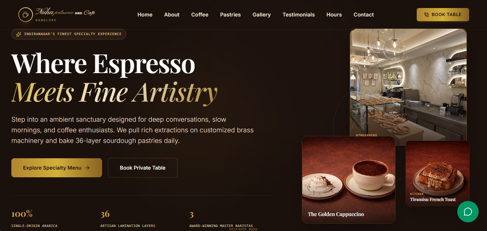
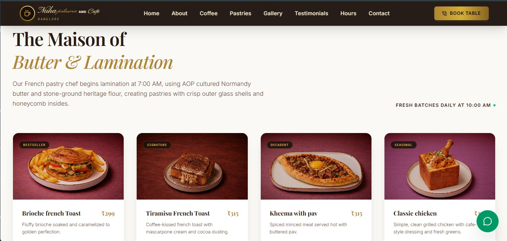
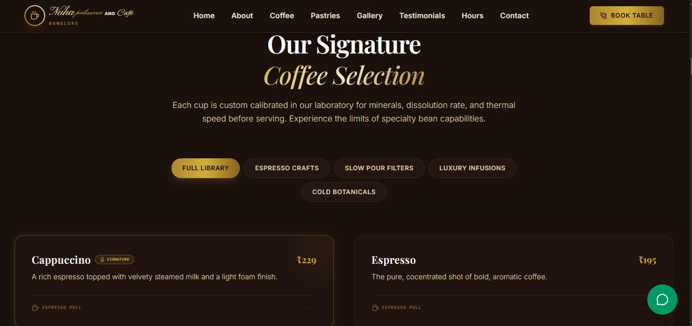

# ☕ Cafe Nuha – Premium Patisserie & Café Website

A modern and responsive website developed for **Cafe Nuha**, a premium patisserie and café in Bengaluru.

The platform showcases the café's ambience, menu offerings, signature desserts, customer reviews, location details, opening hours, and provides direct customer engagement through WhatsApp-powered features including table reservations, custom cake orders, event inquiries, and bulk dessert requests.


## 🌐 Live Website

https://nuha-patisseries-cafe.vercel.app

# ☕ Cafe Nuha – Premium Patisserie & Café Website

## Homepage Preview



## Menu Showcase



## Coffee Section




## ✨ Features

* Modern responsive user interface
* Premium café-inspired branding and design
* Interactive hero section
* Coffee, beverage, and dessert menu showcase
* Pastry and signature item gallery
* Customer testimonials section
* Instagram-style ambience showcase
* Google Maps location integration
* Opening hours and contact information
* Direct WhatsApp inquiry integration
* WhatsApp table reservation workflow
* WhatsApp custom cake ordering system
* WhatsApp bulk dessert order requests
* Event and celebration inquiry support
* Mobile-friendly experience
* Smooth animations and transitions
* Vercel deployment

## 🎯 Business Features

### 📅 Table Reservations

Customers can reserve tables directly through WhatsApp with pre-filled inquiry messages.

### 🎂 Custom Cake Orders

Customers can request customized celebration cakes for birthdays, anniversaries, and special occasions.

### 🍰 Bulk Dessert Orders

Supports inquiries for bulk dessert and pastry orders.

### 🎉 Event & Celebration Inquiries

Customers can reach out for private gatherings, corporate events, and special celebrations.

### 📍 Location & Navigation

Integrated location details and map support help customers easily find the café.

### 📱 Instant Customer Communication

All inquiries are routed directly to the business WhatsApp for faster response times.

## 🛠️ Tech Stack

### Frontend

* React
* TypeScript
* Vite
* Tailwind CSS
* Motion (Animations)
* Lucide React Icons

### Deployment

* Vercel

## 📂 Project Structure

```text
Nuha-Patisseries-Cafe
│
├── public
│   └── assets
│
├── src
│   ├── components
│   ├── data.ts
│   ├── types.ts
│   ├── App.tsx
│   └── main.tsx
│
├── package.json
├── vite.config.ts
└── README.md
```

## 🚀 Running Locally

Clone the repository:

```bash
git clone https://github.com/BhanuPrakashReddyPoli/Nuha-Patisseries-Cafe.git
```

Navigate into the project:

```bash
cd Nuha-Patisseries-Cafe
```

Install dependencies:

```bash
npm install
```

Start development server:

```bash
npm run dev
```

Build for production:

```bash
npm run build
```

## 📸 Highlights

* Elegant café branding
* Premium dessert showcase
* WhatsApp ordering workflow
* Customer engagement sections
* Modern responsive experience

## 👨‍💻 Developer

Bhanu Prakash Reddy Poli

GitHub:
https://github.com/BhanuPrakashReddyPoli

---

Built with ❤️ for Cafe Nuha.
